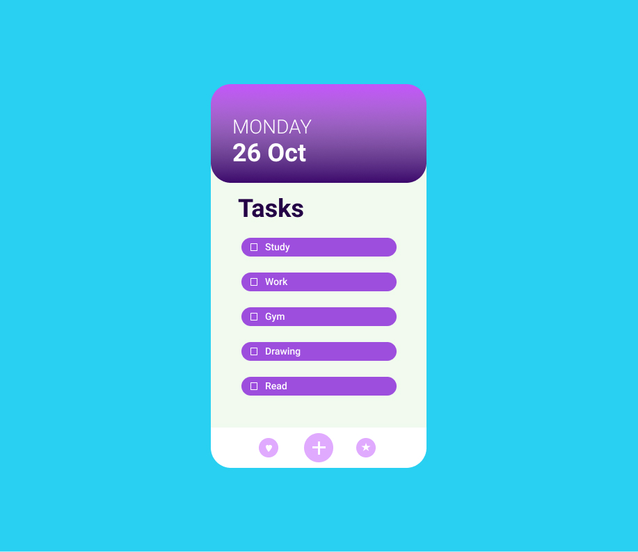
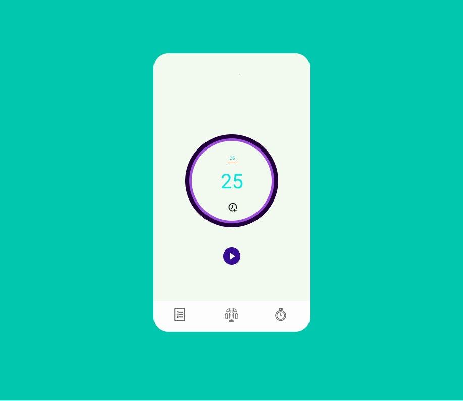
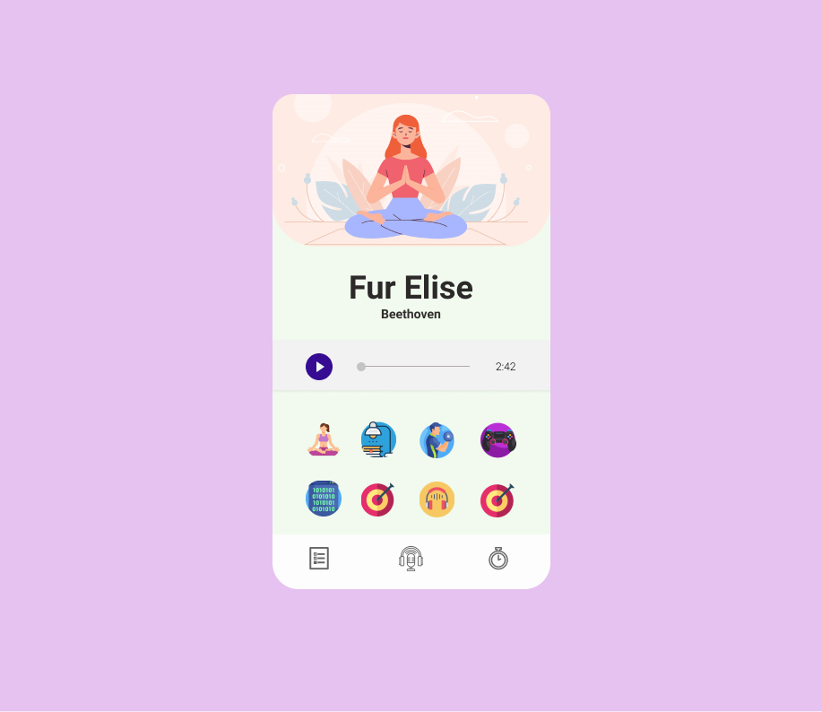

# To-Do

---

> An accountability app that helps users in Habit tracking and increasing productivity in order to have a better approach to their goals.

---

  This app provides three features:
  
   * A task list to help them set priority to their goals/chores.
   * A Pomodoro timer to provide study/break timer pairs to increase productivity.
   * A podcast app with various genres to help you better emulate the environment around you.
 
---

To-Do List             |  Pomodoro Timer             |   Podcast & Lo-Fi
:-------------------------:|:-------------------------:|:-------------------------:
  |    |  

